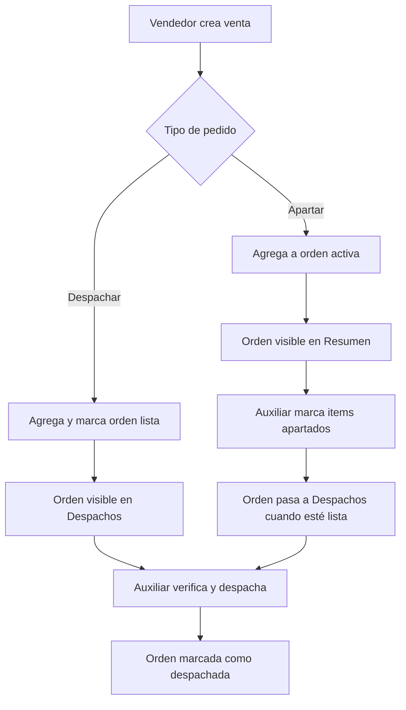

# Sistema de Despachos y Órdenes - IMO

Este documento describe la implementación del nuevo sistema de despachos y órdenes que incluye:

## 🎯 Características Principales

1. **Nuevo rol**: Auxiliar Logístico
2. **Sistema de órdenes**: Consolidación automática de ventas por cliente
3. **Flujo apartado/despacho**: Control del estado de las ventas
4. **Módulo de Resumen de Órdenes**: Gestión de items pendientes
5. **Módulo de Despachos**: Control final de empaque y envío

## 📋 Pasos de Implementación

### 1. Base de Datos

1. **Ejecutar el script principal**:
   ```sql
   -- En Supabase SQL Editor, ejecutar:
   \i create_dispatch_system.sql
   ```

2. **Migrar datos existentes**:
   ```sql
   -- Ejecutar después del script principal:
   \i migrate_dispatch_data.sql
   ```

### 2. Componentes Frontend

Los siguientes componentes ya están creados:

- `OrdersSummary.jsx` - Resumen de órdenes activas
- `DispatchModule.jsx` - Módulo de despachos
- `MainInterface.jsx` - Actualizado con nuevo rol y componentes

### 3. Flujo de Trabajo

#### Para Vendedores:
1. En StockView, crear venta normalmente
2. Seleccionar tipo de pedido:
   - **Apartar**: Agrega a orden del cliente sin finalizar
   - **Despachar**: Agrega a orden y marca como lista para despacho

#### Para Auxiliar Logístico:
1. **Resumen de Órdenes**: 
   - Ver todas las órdenes activas
   - Marcar items como "apartados" ✅
   
2. **Despachos**:
   - Ver órdenes listas para despacho
   - Verificar items apartados
   - Marcar como "Despachado" o "Dejar Pendiente"

## 🗃️ Estructura de Base de Datos

### Nuevas Tablas:

1. **`customer_orders`**
   - Agrupa ventas por cliente
   - Estados: active, ready_for_dispatch, dispatched, pending
   - Totales automáticos

2. **`order_items`**
   - Items individuales de cada orden
   - Control de apartado por auxiliar logístico
   - Referencia a venta original

### Campos Modificados:

1. **`sales`**
   - `dispatch_type`: 'separate' | 'dispatch'
   - `order_id`: Referencia a customer_orders

## 🔧 Lógica Automática

### Triggers y Funciones:

1. **`handle_order_logic()`**: 
   - Crea/actualiza órdenes automáticamente
   - Maneja transición de estados

2. **`create_order_items()`**:
   - Crea items de orden automáticamente
   - Actualiza totales

3. **Triggers**:
   - Ejecutan automáticamente en INSERT de sales
   - Mantienen consistencia de datos

## 🚀 Flujo Completo



## 🔐 Permisos por Rol

### Auxiliar Logístico:
- ✅ Resumen de Órdenes (marcar apartado)
- ✅ Despachos (verificar y despachar)
- ✅ Inicio
- ❌ Ventas, Producción, Usuarios

### Otros roles:
- Mantienen sus permisos existentes
- Acceso adicional a módulos de despachos

## 📱 Interfaces

### Resumen de Órdenes:
- Tarjetas por cliente con items pendientes
- Botones para marcar items como apartados
- Contadores de progreso

### Despachos:
- Órdenes listas para despacho
- Verificación final de items
- Acciones: "Despachado" o "Dejar Pendiente"

## 🔄 Estados de Orden

1. **Active**: Recibiendo nuevas ventas
2. **Ready for Dispatch**: Lista para despacho
3. **Pending**: Temporalmente pausada
4. **Dispatched**: Completamente despachada

## ⚠️ Consideraciones

1. **Migración**: Los datos existentes se migran automáticamente
2. **Performance**: Índices creados para consultas eficientes
3. **RLS**: Políticas de seguridad por empresa
4. **Consistencia**: Triggers mantienen integridad de datos

## 🧪 Testing

1. Crear usuario con rol 'auxiliar_logistico'
2. Hacer ventas con diferentes tipos de despacho
3. Verificar flujo completo en ambos módulos
4. Probar consolidación automática por cliente

## 🆘 Troubleshooting

Si hay problemas:

1. Verificar que los triggers estén activos:
   ```sql
   SELECT * FROM pg_trigger WHERE tgname LIKE '%order%';
   ```

2. Verificar permisos RLS:
   ```sql
   SELECT * FROM pg_policies WHERE tablename IN ('customer_orders', 'order_items');
   ```

3. Revisar logs de Supabase para errores de triggers